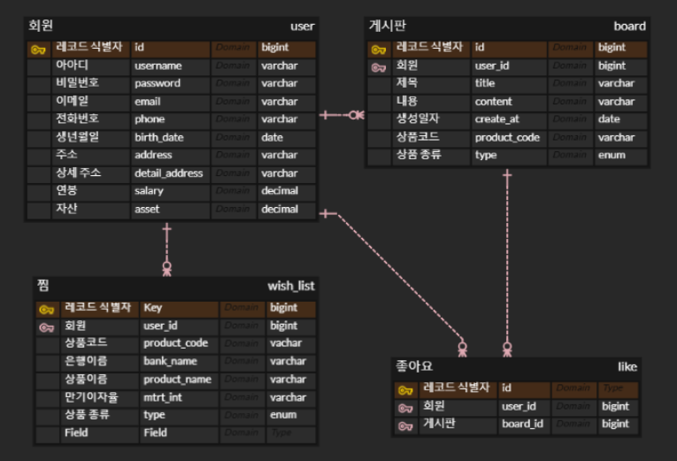
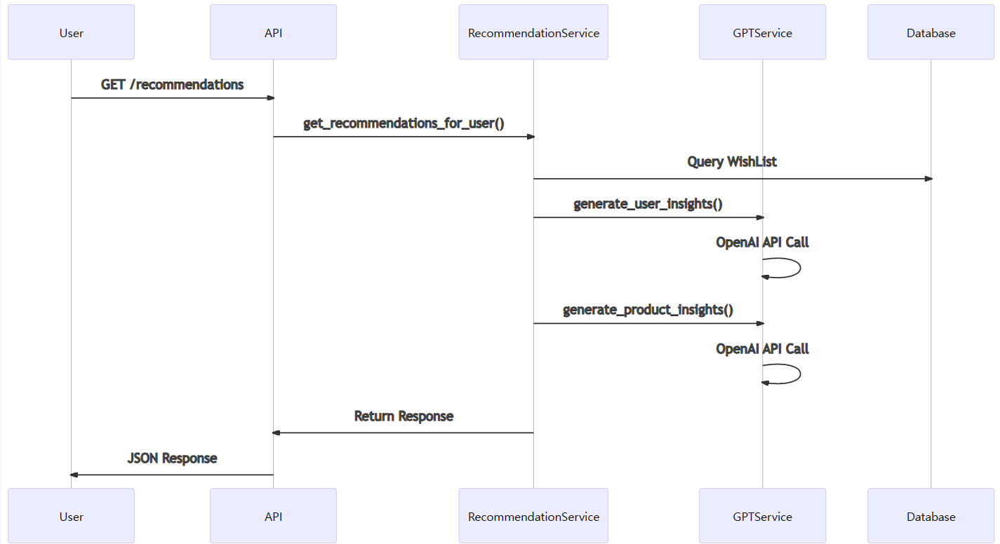

# 🎣 FinPoint: 💰금융 상품 추천 웹서비스

> 🏆 **SSAFY 12기 1학기 관통 프로젝트 우수상 수상**
>
> * **[🧷웹서비스 바로가기(백엔드 배포 중단)](https://finpoint-woo-woong.vercel.app/)**
> * **[🎞시연 영상](https://youtu.be/BZho8io2gHE?feature=shared)**
> * **[📃PPT](https://www.mangoboard.net/publish/44015780)**

## I. 👥 팀원 정보 및 업무 분담 내역

### Team Composition

| 이름   | 역할       | 담당 업무                                                |
| ------ | ---------- | -------------------------------------------------------- |
| 우정훈 | 프론트엔드 | Vue.js 개발, UI/UX 디자인, PPT 작성🎨                    |
| 권상웅 | 백엔드     | Django 개발, 데이터베이스 설계, 금융 상품 추천 AI 기능🤖 |

## II. 🚀 설계 내용 및 실제 구현 정도

### 🛠 Tech Stack

* **Frontend** : Vue.js (반응형 & 동적 인터페이스)
* **Backend** : Django (안정적인 서버 사이드 로직)
* **Database** : SQLite (가벼운 데이터 관리)
* **AI Engine** : OpenAI GPT (지능형 개인화 추천)

### 🏗 Architecture

```
📦 Frontend Project Root
┣ 📂assets
┃ ┣ 📂images
┣ 📂components
┃ ┣ 📂auth
┃ ┣ 📂board
┃ ┣ 📂common
┃ ┣ 📂exchange
┃ ┣ 📂external
┃ ┣ 📂finance
┃ ┣ 📂profile
┃ ┣ 📂smartAssistant
┃ ┗ 📂ui
┃ ┃ ┣ 📂progress
┃ ┃ ┗ 📂sonner
┣ 📂hooks
┃ ┣ 📂auth
┃ ┣ 📂common
┃ ┗ 📂navigator
┣ 📂lib
┣ 📂routes
┃ ┣ 📂layouts
┃ ┣ 📂pages
┃ ┃ ┣ 📂auth
┃ ┃ ┣ 📂board
┃ ┃ ┣ 📂external
┃ ┃ ┣ 📂finance
┃ ┃ ┗ 📜HomePage
┃ ┗ 📜index.js
┣ 📂services
┣ 📂stores

📦 Backend Project Root
┣ 📂 accounts
┣ 📂 board
┣ 📂 exchange_rates
┣ 📂 finance
┣ 📂 FinPoint
┣ 📂 likes
┣ 📂 recommendation
┣ 📂 wishlist
┣ 📂 wishlists
```

### 주요 기능 구현 현황

- [✓] 금융 상품 게시판
- [✓] 상품 상세 정보 조회
- [✓] 연령대 기반 상품 추천
- [✓] AI 활용 개인화 추천

## III. 🗂️ 데이터베이스 모델링 (ERD)

### 테이블

1. User: 기본 사용자 정보와 재무 정보(연봉, 자산)를 저장
2. Board: 금융상품 관련 게시글 (예금, 적금)
3. WishList: 금융상품 가입하기 기능 (사용자당 상품 한번만 가능)
4. Like: 게시글 좋아요 기능 (사용자당 게시글 한번만 가능)



## IV. 🧮 금융 상품 추천 알고리즘 기술 설명

### 1. 추천 알고리즘 특징

#### 1.1 연령대 기반 맞춤 추천

- **연령대 분류 시스템**
  ```python
  def get_age_group(self, age):
      if age < 20: return "10대"
      elif age < 30: return "20대"
      elif age < 40: return "30대"
      elif age < 50: return "40대"
      elif age < 60: return "50대"
      else: return "60대 이상"
  ```
- 생년월일 기반 정확한 나이 계산
  ```python
  def get_age_from_birth_date(self, birth_date):
      today = date.today()
      age = today.year - birth_date.year
      if today.month < birth_date.month or
         (today.month == birth_date.month and today.day < birth_date.day):
          age -= 1 # 생일이 지나지 않았으면 -1살
      return age
  ```

#### 1.2 사용자 찜 이력 분석

- **위시리스트 데이터 활용**
  - 상품 유형별 분리 (예금/적금)
  - 연령대별 선호도 집계
  - 사용자별 중복 추천 방지

#### 1.3 GPT 기반 개인화

- 사용자 프로필 기반 금융 인사이트 생성
- 상품별 맞춤형 추천 이유 제공
- 연령대별 특화된 금융 조언

### 2. 알고리즘 로직 상세

#### 2.1 사용자 연령대 식별


1. **프로필 구성 요소**
   - 나이
   - 연령대
   - 연간 소득
   - 총 자산
   - 상품 유형 선호도

#### 2.2 유사 연령대 찜 상품 분석

```python
def analyze_age_group_preferences(self, product_type, exclude_products=None):
    # 1. 기본 데이터 구조 설정
    age_group_preferences = defaultdict(lambda: defaultdict(int))
    product_codes = {}

    # 2. 위시리스트 쿼리 구성
    wishlists_query = WishList.objects.filter(type=product_type)
    if exclude_products:
        wishlists_query = wishlists_query.exclude(fin_prdt_cd__in=exclude_products)

    # 3. 연령대별 선호도 집계
    for wishlist in wishlists_query:
        if wishlist.user.birth_date:
            age = self.gpt_service.get_age_from_birth_date(wishlist.user.birth_date)
            age_group = self.get_age_group(age)
            age_group_preferences[age_group][wishlist.fin_prdt_nm] += 1
            product_codes[wishlist.fin_prdt_nm] = wishlist.fin_prdt_cd
```

**분석 프로세스**:

1. 동일 연령대 사용자들의 위시리스트 수집
2. 상품별 선호도 빈도 계산
3. 이미 찜한 상품 제외 처리
4. 상품 코드와 이름 매핑 유지

#### 2.3 개인화된 상품 순위 산출

**순위 산출 프로세스**:

```python
def get_top_items(self, preferences_dict, product_codes, n=3):
    # 1. 선호도 기준 정렬
    sorted_items = sorted(
        preferences_dict.items(),
        key=lambda x: x[1],
        reverse=True
    )
    # 2. 상위 n개 상품 추출
    return [
        (name, count, product_codes.get(name))
        for name, count in sorted_items[:n]
    ]
```

**추천 결과 구성**:

```json
{
  "recommendations": [
    {
      "fin_prdt_cd": "상품코드",
      "fin_prdt_nm": "상품명",
      "count": "선호도 수",
      "reason": "GPT 생성 추천 이유",
      "key_features": ["주요 특징 1", "주요 특징 2", "주요 특징 3"]
    }
  ],
  "age_group_statistics": {
    "age_group": "사용자 연령대",
    "popular_products": "연령대 인기 상품 목록"
  },
  "user_insights": {
    "age_based_insight": "연령대별 금융 인사이트",
    "general_advice": "맞춤형 재무 조언"
  }
}
```

#### 2.4 전체적인 금융 상품 로직



### 3. 알고리즘 차별점

#### 3.1 하이브리드 추천 방식

- 협업 필터링 기반의 연령대별 선호도 분석
- GPT 기반의 개인화된 설명 생성
- 사용자

## V. 🌟 서비스 대표 기능 설명

### 1. 금융 상품 게시판

- 다양한 적금/예금 상품 열람
- 상품별 상세 정보 제공

### 2. 개인화 추천 서비스

- 연령대 기반 맞춤 상품 제안
- AI를 통한 지능형 추천

## VI. 🤖 생성형 AI 활용 부분

### AI 활용 포인트

1. 연령대별 선호 금융 상품 패턴 분석
2. 개인화 추천 알고리즘
3. 사용자 가입 이력 기반 인사이트 제공

## VII. 📝 기타 (느낀 점, 후기)

### 프로젝트 성과

- 기술적 성장
- AI 기술의 실제 적용 경험
- 금융 도메인에 대한 이해도 향상

### 프로젝트 챌린지

* **데이터 정제의 어려움** : 금융 데이터의 복잡성을 마주하며 데이터 클렌징의 중요성을 깨달았습니다.
* **AI 모델 신뢰성 확보** : 단순한 추천을 넘어 사용자에게 정말 도움되는 인사이트를 제공하는 것의 어려움
* **개인화의 깊이** : 각 사용자의 재무 여정이 얼마나 다른지, 그리고 그 차이를 AI로 얼마나 섬세하게 반영할 수 있을지에 대한 고민

### 💡 개인적 인사이트

#### 우정훈 (Frontend Developer)

UI/UX 디자인을 통해 사용자가 금융 서비스를 직관적으로 이용할 수 있도록 하는 데 초점을 맞췄습니다. `ky`, `shadcn/ui`, `Lottie` 등 경량화되고 사용하기 쉬운 인기 라이브러리를 선택하여, 그 이유를 고려하면서 적용할 수 있어 뿌듯했습니다. 또한 초기 프로젝트 회의에서 많은 시간을 투자한 만큼, 그 중요성을 실감하게 되었습니다.

#### 권상웅 (Backend Developer)

사용자의 세션 정보를 처리하는 과정에서 cookie에 sessionid를 주는 작업을 하였고, ERD를 `ERDCloud`를 통해 깔끔하게 표현하여 팀원들과의 공유가 용이해졌습니다. 또한 `Postman`을 활용해 API 명세서를 프론트엔드 팀에게 직관적으로 전달할 수 있었습니다. 프론트와 백엔드를 따로 작업하다가 그 두 부분을 연결했을 때, 모든 것이 한 번에 맞아떨어져 짜릿한 성취감을 느꼈습니다.

## 결론

이번 프로젝트를 통해 협업의 중요성과 툴 사용의 이유를 명확히 이해하게 되었습니다. 프로젝트를 진행하면서 각자의 역할에 맞는 툴을 선택하고 그 이유를 고민하는 과정이 매우 중요했음을 깨달았습니다.

이러한 경험을 바탕으로, 향후 프로젝트에서도 협업을 효율적으로 진행하고, 툴을 적절히 활용하여 문제를 해결하는 데 집중할 예정입니다💪
